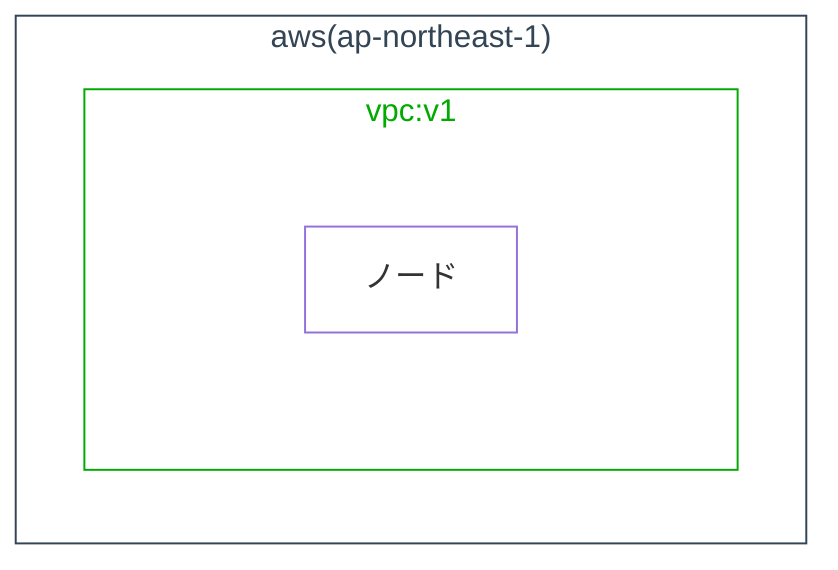

# MermaidでAWS構成図を作成するガイドライン

参考: [MermaidでAWS構成図を作成するテクニック](https://qiita.com/b-mente/items/0172289e5b62645e550c)

〈重要な制約〉

このガイドラインで使用するMermaid拡張構文（`@{}`記法によるAWSアイコン表示）は、環境によって表示が異なります

〈動作環境〉

- VS Code - アイコン表示、クリック機能すべて動作
- Qiita - アイコン表示、クリック機能すべて動作
- Notion - アイコン表示、クリック機能すべて動作
- HTML - アイコン表示、クリック機能すべて動作

〈制限環境〉

- GitHub - 構文エラーなし、ただしアイコン表示されず、クリック機能使えず

## 基本設定

### Mermaid設定

```mermaid
---
config:
  theme: neutral
  flowchart:
    nodeSpacing: 10
    rankSpacing: 30
---
flowchart LR
```

〈設定理由〉

- theme: neutral - シンプルで見やすい
- nodeSpacing: 10 - デフォルト(50)より密
- rankSpacing: 30 - デフォルト(50)より密
- flowchart LR - 左から右へ（外部→内部）

## レイアウト構造

### グループ階層

```mermaid
flowchart LR

internet@{img: "https://api.iconify.design/material-symbols/globe-asia.svg",label: "internet",pos: "b",w: 60,h: 60,constraint: "on"}

subgraph aws["aws(ap-northeast-1)"]
  subgraph vpc-vvvv1["vpc:v1"]
    subgraph group-1-vpc-vvvv1[" "]
      elb-xxxx1@{img: "https://api.iconify.design/logos/aws-elb.svg",label: "elb:<br>xxxx1",pos: "b",w: 60,h: 60,constraint: "on"}
    end
    subgraph group-2-vpc-vvvv1[" "]
      ec2-i-xxxx1@{img: "https://api.iconify.design/logos/aws-ec2.svg",label: "ec2:<br>i-xxxx1",pos: "b",w: 60,h: 60,constraint: "on"}
      ecs-cluster/api1@{img: "https://api.iconify.design/logos/aws-ecs.svg",label: "ecs:<br>cluster/api",pos: "b",w: 60,h: 60,constraint: "on"}
    end
    subgraph group-3-vpc-vvvv1[" "]
      rds-xxxx1@{img: "https://api.iconify.design/logos/aws-rds.svg",label: "rds:<br>xxxx1",pos: "b",w: 60,h: 60,constraint: "on"}
    end
  end
  subgraph group-4[" "]
    s3-xxxx1@{img: "https://api.iconify.design/logos/aws-s3.svg",label: "s3:<br>xxxx1",pos: "b",w: 60,h: 60,constraint: "on"}
  end
end
```

### 層の接続

実際のノードIDを使用して、左から右へ接続

```mermaid
flowchart LR

internet@{img: "https://api.iconify.design/material-symbols/globe-asia.svg",label: "internet",pos: "b",w: 60,h: 60,constraint: "on"}
elb-xxxx1@{img: "https://api.iconify.design/logos/aws-elb.svg",label: "elb:<br>xxxx1",pos: "b",w: 60,h: 60,constraint: "on"}
ec2-i-xxxx1@{img: "https://api.iconify.design/logos/aws-ec2.svg",label: "ec2:<br>i-xxxx1",pos: "b",w: 60,h: 60,constraint: "on"}
ecs-cluster/api1@{img: "https://api.iconify.design/logos/aws-ecs.svg",label: "ecs:<br>cluster/api",pos: "b",w: 60,h: 60,constraint: "on"}
rds-xxxx1@{img: "https://api.iconify.design/logos/aws-rds.svg",label: "rds:<br>xxxx1",pos: "b",w: 60,h: 60,constraint: "on"}
s3-xxxx1@{img: "https://api.iconify.design/logos/aws-s3.svg",label: "s3:<br>xxxx1",pos: "b",w: 60,h: 60,constraint: "on"}

internet ----- |"admin.test.co.jp"| elb-xxxx1 --- ec2-i-xxxx1
internet ----- |"api.test.co.jp"| elb-xxxx1 --- ecs-cluster/api1

ec2-i-xxxx1 --- rds-xxxx1
ecs-cluster/api1 --- rds-xxxx1
rds-xxxx1 --- s3-xxxx1
```

〈接続理由〉

- 実際のノードID（`elb-xxxx1`, `ec2-i-xxxx1`等）を使用
- 左→右の順序を保証
- データフローを明示的に表現

## ノードの記述

### AWS公式アイコンの使用

```mermaid
flowchart LR
elb-xxxx1@{img: "https://api.iconify.design/logos/aws-elb.svg",label: "elb:<br>test_elb",pos: "b",w: 60,h: 60,constraint: "on"}
```

〈パラメータ説明〉

- img: アイコンURL（Iconify API）
- label: サービス名とリソース名（`<br>`で改行）
- pos: "b" (ラベル位置: bottom)
- w, h: 60 (アイコンサイズ)
- constraint: "on" (アスペクト比維持)

### ノードID規則

| サービス | ノードID例 | 理由 |
|---------|-----------|------|
| ELB | elb-xxxx1 (DNSName) | 一意で短い |
| EC2 | ec2-i-xxxx1 (InstanceId) | 一意で短い |
| ECS | ecs-cluster/api1 (Cluster/Service) | 一意で短い |
| RDS | rds-xxxx1 (DBClusterIdentifier) | 一意で短い |
| S3 | s3-xxxx1 (BucketName) | 一意で短い |

### 主要AWSアイコンURL

| サービス | URL |
|---------|-----|
| ELB | <https://api.iconify.design/logos/aws-elb.svg> |
| EC2 | <https://api.iconify.design/logos/aws-ec2.svg> |
| ECS | <https://api.iconify.design/logos/aws-ecs.svg> |
| RDS | <https://api.iconify.design/logos/aws-rds.svg> |
| S3 | <https://api.iconify.design/logos/aws-s3.svg> |
| Lambda | <https://api.iconify.design/logos/aws-lambda.svg> |
| DynamoDB | <https://api.iconify.design/logos/aws-dynamodb.svg> |
| CloudFront | <https://api.iconify.design/logos/aws-cloudfront.svg> |
| Route53 | <https://api.iconify.design/logos/aws-route53.svg> |
| IAM | <https://api.iconify.design/logos/aws-iam.svg> |

完全なリスト: <https://icon-sets.iconify.design/logos/> (aws-で検索)

## 接続の記述

### 接続線の長さとラベル

```mermaid
flowchart LR

A1 ---|短い| B1
A2 ----|中間| B2
A3 -----|長い| B3

internet@{img: "https://api.iconify.design/material-symbols/globe-asia.svg",label: "internet",pos: "b",w: 60,h: 60,constraint: "on"}
elb-xxxx1@{img: "https://api.iconify.design/logos/aws-elb.svg",label: "elb:<br>xxxx1",pos: "b",w: 60,h: 60,constraint: "on"}

internet ----- |"admin.test.co.jp"| elb-xxxx1
internet ----- |"api.test.co.jp"| elb-xxxx1
```

〈推奨〉

- internet → ELB: 長い（5個）- ラベル（ドメイン）が線とずれないように
- ELB → EC2/ECS: 短い（3個）- 間延びしないように

## クリック機能

### マネジメントコンソールURL構造

```text
https://(アカウント).(リージョン).console.aws.amazon.com/(サービス)/(パス)
```

### サービス別URL

```mermaid
flowchart LR

elb-xxxx@{img: "https://api.iconify.design/logos/aws-elb.svg",label: "elb:<br>xxxx",pos: "b",w: 60,h: 60,constraint: "on"}
ec2-i-xxxx@{img: "https://api.iconify.design/logos/aws-ec2.svg",label: "ec2:<br>i-xxxx",pos: "b",w: 60,h: 60,constraint: "on"}
ecs-cluster/service@{img: "https://api.iconify.design/logos/aws-ecs.svg",label: "ecs:<br>cluster/service",pos: "b",w: 60,h: 60,constraint: "on"}
rds-xxxx@{img: "https://api.iconify.design/logos/aws-rds.svg",label: "rds:<br>xxxx",pos: "b",w: 60,h: 60,constraint: "on"}
s3-xxxx@{img: "https://api.iconify.design/logos/aws-s3.svg",label: "s3:<br>xxxx",pos: "b",w: 60,h: 60,constraint: "on"}

click elb-xxxx href "https://000000000000.ap-northeast-1.console.aws.amazon.com/ec2/home?region=ap-northeast-1#LoadBalancer:loadBalancerArn=arn:aws:elasticloadbalancing:..." _blank
click ec2-i-xxxx href "https://000000000000.ap-northeast-1.console.aws.amazon.com/ec2/home?region=ap-northeast-1#InstanceDetails:instanceId=i-xxxx" _blank
click ecs-cluster/service href "https://000000000000.ap-northeast-1.console.aws.amazon.com/ecs/v2/clusters/(cluster)/services/(service)/health?region=ap-northeast-1" _blank
click rds-xxxx href "https://000000000000.ap-northeast-1.console.aws.amazon.com/rds/home/?region=ap-northeast-1#database:id=(cluster);is-cluster=true" _blank
click s3-xxxx href "https://000000000000.ap-northeast-1.console.aws.amazon.com/s3/buckets/(bucket)?region=ap-northeast-1&bucketType=general&tab=objects" _blank
```

## スタイル定義



〈スタイル説明〉

- AWS: 青系の枠線
- VPC: 緑系の枠線
- group: 非表示（枠線なし、背景なし）

## 完全な実装例

```mermaid
---
title: 000000000000-xxxxxxxx環境
config:
  theme: neutral
  flowchart:
    nodeSpacing: 10
    rankSpacing: 30
---
flowchart LR

internet@{img: "https://api.iconify.design/material-symbols/globe-asia.svg",label: "internet",pos: "b",w: 60,h: 60,constraint: "on"}

subgraph aws["aws(ap-northeast-1)"]
  subgraph vpc-vvvv1["vpc:v1"]
    subgraph group-1-vpc-vvvv1[" "]
      elb-xxxx1@{img: "https://api.iconify.design/logos/aws-elb.svg",label: "elb:<br>test_elb",pos: "b",w: 60,h: 60,constraint: "on"}
    end
    subgraph group-2-vpc-vvvv1[" "]
      ec2-i-xxxx1@{img: "https://api.iconify.design/logos/aws-ec2.svg",label: "ec2:<br>admin",pos: "b",w: 60,h: 60,constraint: "on"}
      ecs-cluster/api1@{img: "https://api.iconify.design/logos/aws-ecs.svg",label: "ecs:<br>cluster/api",pos: "b",w: 60,h: 60,constraint: "on"}
    end
    subgraph group-3-vpc-vvvv1[" "]
      rds-xxxx1@{img: "https://api.iconify.design/logos/aws-rds.svg",label: "rds:<br>xxxx",pos: "b",w: 60,h: 60,constraint: "on"}
    end
  end
  subgraph group-4[" "]
     s3-xxxx1@{img: "https://api.iconify.design/logos/aws-s3.svg",label: "s3:<br>xxxx",pos: "b",w: 60,h: 60,constraint: "on"}
  end
end

internet ----- |"admin.test.co.jp"| elb-xxxx1 --- ec2-i-xxxx1
internet ----- |"api.test.co.jp"| elb-xxxx1 --- ecs-cluster/api1

ec2-i-xxxx1 --- rds-xxxx1
ecs-cluster/api1 --- rds-xxxx1
rds-xxxx1 --- s3-xxxx1

click ec2-i-xxxx1 href "https://aws.amazon.com/" _blank
click ecs-cluster/api1 href "https://aws.amazon.com/" _blank
click elb-xxxx1 href "https://aws.amazon.com/" _blank
click rds-xxxx1 href "https://aws.amazon.com/" _blank
click s3-xxxx1 href "https://aws.amazon.com/" _blank

classDef default fill:#fff
style aws fill:#fff,color:#345,stroke:#345
classDef group fill:none,stroke:none
classDef vpc fill:#fff,color:#0a0,stroke:#0a0
class vpc-vvvv1 vpc
class group-1-vpc-vvvv1,group-2-vpc-vvvv1,group-3-vpc-vvvv1,group-4 group
```

## 注意事項

### 表示環境

〈表示可能〉

- Notion
- HTML
- PDF
- VS Code

〈制限あり（アイコン非表示、クリック機能なし）〉

- GitHub - 構文は正常だがアイコン表示されない
- VS Code - プレビューでアイコン表示されない

### セキュリティ

- マネジメントコンソールURL直アクセス時、事前にログインが必要
- セッションがない場合「セッションが無効」エラー

### 設計フェーズでの構成図作成

〈実装前〉

要件からAWSサービスを選定し、リソースIDは仮の命名規則で記載

```mermaid
flowchart LR
s3-myproject-dev-source@{img: "https://api.iconify.design/logos/aws-s3.svg",label: "s3:<br>myproject-dev-source",pos: "b",w: 60,h: 60,constraint: "on"}
lambda-myproject-dev-processor@{img: "https://api.iconify.design/logos/aws-lambda.svg",label: "lambda:<br>myproject-dev-processor",pos: "b",w: 60,h: 60,constraint: "on"}
```

〈実装後の更新〉

CDKコードから実際のリソース名を抽出して構成図を更新

```typescript
// CDKコードから抽出
const sourceBucketName = `${projectName}-${envName}-source`;
const functionName = `${projectName}-${envName}-function`;
```

## 統合設計書フォーマット（簡易的なプロジェクト向け）

データ連携など簡易的なプロジェクトでは、1つの統合設計書に全情報をまとめる

### 基本構成

```markdown
# プロジェクト名 データ連携設計

## データソース - データターゲット連携 詳細設計

### 全体図

（Mermaid flowchart LR図 - 必ず左から右への横長フロー）

### 概要

データ連携の目的と処理フローを3-5行で説明

### 連携対象データ

（表形式でソース・ターゲットを記載、該当する場合のみ）

### 以降のセクション

プロジェクトで使用するAWSリソースに応じて、必要なセクションを追加

必須セクション

- IAM（IAM Role一覧、権限詳細を表形式またはJSON形式で）
- セキュリティ設計（S3暗号化、IAM最小権限、開発環境と本番環境の差異）
- 運用（デプロイ手順、手動実行、動作確認、クリーンアップ）

条件付きセクション（使用する場合のみ）

- S3バケット設定（バケット名、用途、設定を表形式で）
- Glue Data Catalog（データベース、テーブル一覧、DDL）
- Athena（WorkGroup設定）
- EventBridge（Scheduler設定、cron式）
- Lambda（関数設定、処理概要）
- Step Functions（State Machine名、処理フロー、SQL定義）
- CloudWatch Alarm（アラーム名、メトリクス、条件、アクション）
- その他のAWSサービス（RDS、DynamoDB、Glue等、プロジェクトに応じて）
```

### Mermaid図の配置（統合設計書）

統合設計書では、最初に全体構成図を配置する

プロジェクトの実際の構成に応じて、使用するAWSサービスをMermaid図に含める

重要: 必ず `flowchart LR`（左から右）を使用する

#### パターン1: シングルアカウント構成（推奨）

主要なサービスを左から右に直接配置し、関連リソースのみsubgraphでグループ化

```mermaid
---
config:
  theme: neutral
  flowchart:
    nodeSpacing: 15
    rankSpacing: 40
---
flowchart LR

eventbridge@{img: "https://api.iconify.design/logos/aws-eventbridge.svg",label: "EventBridge Scheduler",pos: "b",w: 40,h: 40,constraint: "on"}
sfn@{img: "https://api.iconify.design/logos/aws-step-functions.svg",label: "Step Functions",pos: "b",w: 40,h: 40,constraint: "on"}
athena@{img: "https://api.iconify.design/logos/aws-athena.svg",label: "Athena",pos: "b",w: 40,h: 40,constraint: "on"}

subgraph data[" "]
  direction TB
  glue@{img: "https://api.iconify.design/logos/aws-glue.svg",label: "Glue Data Catalog",pos: "b",w: 40,h: 40,constraint: "on"}
  s3-source@{img: "https://api.iconify.design/logos/aws-s3.svg",label: "S3 Source",pos: "b",w: 40,h: 40,constraint: "on"}
  s3-target@{img: "https://api.iconify.design/logos/aws-s3.svg",label: "S3 Target",pos: "b",w: 40,h: 40,constraint: "on"}
end

eventbridge --> sfn
sfn --> athena
athena --> glue
glue ~~~ s3-source
glue ~~~ s3-target

classDef groupStyle fill:none,stroke:none
class data groupStyle
```

#### パターン2: クロスアカウント構成

アカウント境界を明示する必要がある場合のみ使用

```mermaid
---
config:
  theme: neutral
  flowchart:
    nodeSpacing: 15
    rankSpacing: 40
---
flowchart LR

subgraph account1["ソースアカウント"]
  direction TB
  aurora@{img: "https://api.iconify.design/logos/aws-rds.svg",label: "Aurora",pos: "b",w: 35,h: 35,constraint: "on"}
  export-role@{img: "https://api.iconify.design/logos/aws-iam.svg",label: "Export Role",pos: "b",w: 35,h: 35,constraint: "on"}
end

subgraph account2["データ基盤アカウント"]
  direction TB
  eventbridge@{img: "https://api.iconify.design/logos/aws-eventbridge.svg",label: "EventBridge",pos: "b",w: 40,h: 40,constraint: "on"}
  sfn@{img: "https://api.iconify.design/logos/aws-step-functions.svg",label: "Step Functions",pos: "b",w: 40,h: 40,constraint: "on"}
  s3@{img: "https://api.iconify.design/logos/aws-s3.svg",label: "S3",pos: "b",w: 40,h: 40,constraint: "on"}
end

aurora --> export-role
export-role --> eventbridge
eventbridge --> sfn
sfn --> s3

style account1 fill:#fff,stroke:#333,stroke-width:2px
style account2 fill:#fff,stroke:#333,stroke-width:2px
```

重要なポイント

- 必ず `flowchart LR`（左から右）を使用する
- 主要なサービス（EventBridge、Step Functions、Athena等）は左から右に直接配置
- データ関連のリソース（Glue、S3等）のみをsubgraphでグループ化
- subgraph内は `direction TB`（上から下）でサービスを縦に配置
- ラベルはシンプルに、改行タグは使わない
- クロスアカウント連携の場合のみsubgraphでアカウント境界を明示
- 接続は `-->` （実線）、`~~~` （非表示）、`-.->` （破線）で整理
- 使用するAWSサービスのみを図に含める
- リソース名は実際のCDK実装に基づく

### プロジェクト固有のカスタマイズ

パターン1をベースに、プロジェクト固有のリソースを追加する方法

#### 1. リソースの追加

プロジェクトで使用する追加のAWSサービスを図に追加する

追加が必要になる主なリソース

- S3 Query Results（Athenaクエリ結果格納）
- IAM Role（権限管理）
- CloudWatch Logs（ログ保存）
- SNS Topic（通知）
- その他プロジェクト固有のリソース

追加方法

```mermaid
flowchart LR

eventbridge@{img: "https://api.iconify.design/logos/aws-eventbridge.svg",label: "EventBridge Scheduler",pos: "b",w: 40,h: 40,constraint: "on"}
sfn@{img: "https://api.iconify.design/logos/aws-step-functions.svg",label: "Step Functions",pos: "b",w: 40,h: 40,constraint: "on"}

subgraph data[" "]
  direction TB
  glue@{img: "https://api.iconify.design/logos/aws-glue.svg",label: "Glue",pos: "b",w: 40,h: 40,constraint: "on"}
  s3-source@{img: "https://api.iconify.design/logos/aws-s3.svg",label: "S3 Source",pos: "b",w: 40,h: 40,constraint: "on"}
end

s3-query@{img: "https://api.iconify.design/logos/aws-s3.svg",label: "S3 Query Results",pos: "b",w: 40,h: 40,constraint: "on"}
iam@{img: "https://api.iconify.design/logos/aws-iam.svg",label: "IAM Role",pos: "b",w: 35,h: 35,constraint: "on"}

eventbridge --> sfn
sfn --> glue
sfn -.-> s3-query
sfn -.-> iam

classDef groupStyle fill:none,stroke:none
class data groupStyle
```

ポイント

- 主要フロー外のリソース（S3 Query Results、IAM Role）はsubgraphの外に配置
- 関連を示す場合は破線（`-.->` ）を使用

#### 2. ラベルのカスタマイズ

プロジェクトの処理内容を明示するため、ラベルに具体的な情報を追加する

基本テンプレート

```
label: "サービス名"
```

カスタマイズ例

```
label: "Step Functions .sync統合"
label: "Athena DELETE + INSERT"
label: "S3 Source CSV"
label: "S3 Target Parquet"
```

カスタマイズ方針

- 統合パターンを明記（.sync統合、非同期統合等）
- 処理内容を明記（DELETE + INSERT、COPY、MERGE等）
- データ形式を明記（CSV、Parquet、JSON等）

#### 3. 接続の使い分け

接続の種類

| 接続 | 用途 | 例 |
| ---- | ---- | -- |
| `-->` | 主要なデータフロー | EventBridge → Step Functions → Athena |
| `~~~` | subgraph内の配置調整（非表示） | Glue ~~~ S3 Source ~~~ S3 Target |
| `-.->` | 関連リソース（サポート） | Step Functions -.-> IAM Role |

使い分けの基準

実線（`-->`）

- データが実際に流れる経路
- 処理の順序を表す
- 主要なフロー

非表示（`~~~`）

- subgraph内でリソースを縦に並べるためだけに使用
- 実際のデータフローではない
- 視覚的な整理のため

破線（`-.->` ）

- 関連はあるが主要フローではない
- 権限の付与（Step Functions → IAM Role）
- クエリ結果の保存（Athena → S3 Query Results）
- ログの出力（Lambda → CloudWatch Logs）

#### 4. 完成形の例（sample_sfn_athena）

パターン1をカスタマイズした実際のプロジェクト例

```mermaid
---
config:
  theme: neutral
  flowchart:
    nodeSpacing: 15
    rankSpacing: 40
---
flowchart LR

eventbridge@{img: "https://api.iconify.design/logos/aws-eventbridge.svg",label: "EventBridge Scheduler",pos: "b",w: 40,h: 40,constraint: "on"}
sfn@{img: "https://api.iconify.design/logos/aws-step-functions.svg",label: "Step Functions .sync統合",pos: "b",w: 40,h: 40,constraint: "on"}
athena@{img: "https://api.iconify.design/logos/aws-athena.svg",label: "Athena DELETE + INSERT",pos: "b",w: 40,h: 40,constraint: "on"}

subgraph data[" "]
  direction TB
  glue@{img: "https://api.iconify.design/logos/aws-glue.svg",label: "Glue Data Catalog",pos: "b",w: 40,h: 40,constraint: "on"}
  s3-source@{img: "https://api.iconify.design/logos/aws-s3.svg",label: "S3 Source CSV",pos: "b",w: 40,h: 40,constraint: "on"}
  s3-target@{img: "https://api.iconify.design/logos/aws-s3.svg",label: "S3 Target Parquet",pos: "b",w: 40,h: 40,constraint: "on"}
end

s3-query@{img: "https://api.iconify.design/logos/aws-s3.svg",label: "S3 Query Results",pos: "b",w: 40,h: 40,constraint: "on"}
iam@{img: "https://api.iconify.design/logos/aws-iam.svg",label: "IAM Role",pos: "b",w: 35,h: 35,constraint: "on"}

eventbridge --> sfn
sfn --> athena
athena --> glue
glue ~~~ s3-source
glue ~~~ s3-target
athena -.-> s3-query
sfn -.-> iam

classDef groupStyle fill:none,stroke:none
class data groupStyle
```

カスタマイズのポイント

1. ラベルに処理内容を追加
   - `"Step Functions"` → `"Step Functions .sync統合"`
   - `"Athena"` → `"Athena DELETE + INSERT"`
   - `"S3 Source"` → `"S3 Source CSV"`
   - `"S3 Target"` → `"S3 Target Parquet"`

2. プロジェクト固有のリソースを追加
   - S3 Query Results（Athenaクエリ結果格納）
   - IAM Role（権限管理）

3. 接続を適切に使い分け
   - 実線: 主要なデータフロー（EventBridge → Step Functions → Athena → Glue）
   - 非表示: データリソースの配置調整（Glue ~~~ S3 Source ~~~ S3 Target）
   - 破線: 関連リソース（Athena -.-> S3 Query Results, Step Functions -.-> IAM Role）

この完成形を参考に、プロジェクト固有の要件に応じてカスタマイズする

利点

- 1ファイルで全体像を把握できる
- ドキュメントの分散を防ぐ
- シンプルなプロジェクトに最適
- プロジェクトの実際の構成に柔軟に対応
