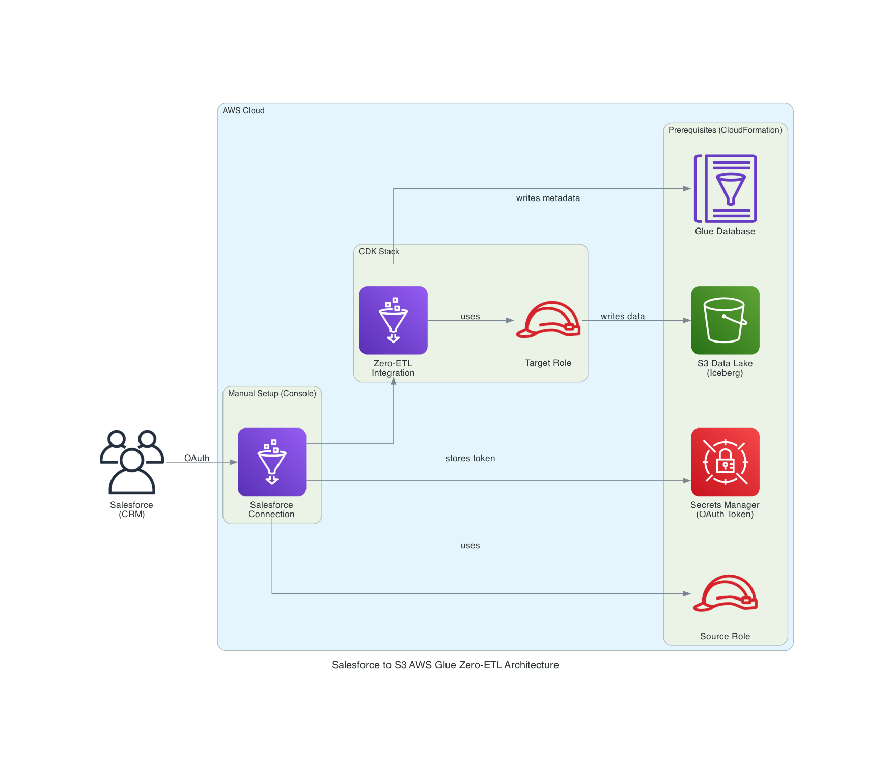

# Salesforce to S3 AWS Glue Zero ETL Integration

AWS Glue Zero ETL integration from Salesforce to S3 using a hybrid approach.

## Project Overview

This project uses AWS Glue Zero ETL to automatically sync Salesforce data to Amazon S3 (Glue Data Catalog with Iceberg).

The hybrid approach separates resources based on deployment constraints:

- CloudFormation YAML: S3 Bucket, Source Role, Glue Database (needed before Console/CDK)
- AWS Console: Salesforce Connection (AWS Managed App with browser OAuth)
- Shell Script: Catalog Resource Policy (no CloudFormation support)
- CDK: Target Role, Integration

## Architecture



```text
CloudFormation (cfn/prerequisites.yaml)
  ├── S3 Data Lake Bucket
  ├── Source IAM Role
  └── Glue Database

AWS Console (manual)
  └── Salesforce Connection (AWS Managed App)

Shell Script (scripts/setup-prereqs.sh)
  └── Catalog Resource Policy

CDK (cdk/)
  ├── Target IAM Role
  ├── Integration Resource Property
  └── Zero-ETL Integration
```

## Why Hybrid Approach

AWS Glue Salesforce connections support two authentication methods:

### Customer Managed App (Full IaC, but complex)

1. Create External Client App in Salesforce
2. Get Consumer Key and Consumer Secret
3. Get Authorization Code via browser redirect
4. Exchange Authorization Code for Refresh Token via curl
5. Store credentials in AWS Secrets Manager with specific key names (`clientId`, `clientSecret`, `refreshToken`)
6. Configure CfnConnection with OAuth2 properties

This approach enables full Infrastructure as Code, but requires manual OAuth token retrieval and careful Secrets Manager configuration.

### AWS Managed App (Hybrid, simple)

1. Create Salesforce Connection in AWS Console
2. Complete browser-based OAuth authentication
3. AWS handles token management automatically

This approach requires manual Console steps but eliminates OAuth complexity.

This project uses AWS Managed App because:

- Significantly simpler authentication flow
- No need to manage OAuth tokens or Secrets Manager
- AWS handles token refresh automatically
- Trade-off: Connection creation requires AWS Console (cannot be fully automated)

## Features

- Hybrid approach: Each resource deployed via the most appropriate method
- AWS Managed App: Simple browser-based OAuth authentication
- Secure design: IAM role separation for source and target
- Auto sync: Automatic data synchronization at 60-minute intervals (customizable)
- Iceberg format: ACID transactions and time travel capabilities
- Infrastructure as Code: CDK + CloudFormation for reproducible infrastructure

## Configuration

Before deployment, customize the following configuration files for your environment.

### Shell Scripts (scripts/config.sh)

Edit `scripts/config.sh` to set your project name and environment:

```bash
PROJECT_NAME="my-sf-zeroetl"
ENV_NAME="dev"
# REGION="us-east-1"  # Optional - defaults to AWS CLI region
```

### CDK Parameters (cdk/lib/parameter.ts)

Edit `cdk/lib/parameter.ts` to configure sync frequency and data filter:

```typescript
export const devParameter: AppParameter = {
  envName: 'dev',
  projectName: 'my-sf-zeroetl',
  syncFrequencyMinutes: 15,
  dataFilter: 'include:Account,include:Contact',  // Salesforce objects to sync
  env: { ... },
};
```

### CloudFormation Parameters (cfn/prerequisites.yaml)

When deploying the CloudFormation stack, you can override defaults:

```bash
aws cloudformation deploy \
  --template-file cfn/prerequisites.yaml \
  --stack-name my-sf-zeroetl-dev-prerequisites \
  --parameter-overrides ProjectName=my-sf-zeroetl EnvName=dev \
  --capabilities CAPABILITY_NAMED_IAM
```

### Important

When changing project name, update all configuration files consistently:

1. `scripts/config.sh` - PROJECT_NAME
2. `cdk/lib/parameter.ts` - projectName
3. `cfn/prerequisites.yaml` - ProjectName parameter (when deploying)

## Prerequisites

### Salesforce Side

- Salesforce account (Developer Edition or production environment)

### AWS Side

- AWS account
- AWS CLI configured (v2.x recommended)
- Node.js 20.x or later
- AWS CDK CLI 2.170.0 or later

## Deployment Steps

### 1. Deploy Prerequisites (CloudFormation)

Deploy the S3 bucket, Source Role, and Glue Database:

```bash
aws cloudformation deploy \
  --template-file cfn/prerequisites.yaml \
  --stack-name my-sf-zeroetl-dev-prerequisites \
  --capabilities CAPABILITY_NAMED_IAM \
  --profile YOUR_AWS_PROFILE
```

### 2. Create Salesforce Connection in AWS Console

1. Go to AWS Glue Console > Data Catalog > Connections
2. Click "Create connection"
3. Step 1 (Choose data source): Select "Salesforce"
4. Step 2 (Configure connection):
   - Instance URL: `https://<your-domain>.my.salesforce.com` (Salesforce login URL)
   - Salesforce environment: Production
   - IAM service role: `my-sf-zeroetl-dev-source-role`
   - OAuth grant type: Authorization Code
   - Check "Use AWS managed client application"
   - AWS Secret: Use `SalesforceOAuthSecretName` from CloudFormation outputs
5. Step 3 (Set properties):
   - Connection name: `my-sf-zeroetl-dev-salesforce-connection`
6. Step 4 (Review and create): Click "Create connection"
7. Complete OAuth authentication in the browser popup

Note: Instance URL is your Salesforce login URL. Find it in Salesforce Setup > Company Information.

### 3. Set Catalog Resource Policy

```bash
cd scripts
AWS_PROFILE=YOUR_AWS_PROFILE ./setup-prereqs.sh
```

### 4. CDK Project Setup

```bash
cd cdk
pnpm install
```

### 5. Verify parameter.ts Configuration

Check `cdk/lib/parameter.ts` and edit as needed:

```typescript
export const devParameter: AppParameter = {
  envName: "dev",
  projectName: "my-sf-zeroetl",
  syncFrequencyMinutes: 60,
  env: {
    account: process.env.CDK_DEFAULT_ACCOUNT,
    region: process.env.CDK_DEFAULT_REGION,
  },
};
```

### 6. CDK Deployment

```bash
pnpm cdk deploy --all --require-approval never --profile YOUR_AWS_PROFILE
```

### 7. Verify Deployment

After deployment, the following output values will be displayed:

- `DataLakeBucketName`: S3 Data Lake bucket name
- `GlueDatabaseName`: Glue Database name
- `IntegrationArn`: Zero-ETL Integration ARN
- `ConnectionName`: Salesforce Connection name
- `SourceRoleArn`: Source role ARN
- `TargetRoleArn`: Target role ARN

Check the Zero ETL Integration status in the Glue console:

1. AWS Glue Console > Data Catalog > Zero-ETL integrations
2. Select the created integration
3. Wait for status to become "Active"

### 8. Verify Data

#### Query with Athena

```sql
USE my_sf_zeroetl_dev;
SHOW TABLES;
SELECT * FROM account LIMIT 10;
```

#### Verify Data in S3

```bash
aws s3 ls s3://my-sf-zeroetl-dev-datalake/data/ \
  --recursive --profile YOUR_AWS_PROFILE
```

### 9. Verify Incremental Sync (INSERT/UPDATE/DELETE)

Confirm that changes in Salesforce are automatically synced.

#### INSERT Test

1. Create a new Account in Salesforce
   - Login to Salesforce
   - Click the App Launcher (9-dot grid icon in top left)
   - Search "Accounts" and select it
   - Click "New" button
   - Enter Account Name (e.g., "Test Account for Zero-ETL")
   - Click "Save"
2. Wait for sync interval or trigger manual sync
3. Verify the new record in Athena

```sql
-- Check new records
SELECT id, name, createddate, systemmodstamp
FROM account
ORDER BY createddate DESC
LIMIT 5;
```

#### UPDATE Test

1. Update a record in Salesforce
   - Go to Accounts list
   - Click on an existing Account name
   - Click "Edit" button (or pencil icon)
   - Change Account Name (e.g., add " - Updated")
   - Click "Save"
2. Wait for sync interval
3. Query the updated data in Athena

```sql
-- Check recent updates
SELECT id, name, systemmodstamp
FROM account
ORDER BY systemmodstamp DESC
LIMIT 5;
```

Note: `systemmodstamp` is automatically updated by Salesforce when a record is modified.

#### DELETE Test

1. Delete a record in Salesforce
   - Go to Accounts list
   - Click dropdown arrow on the right of a record row
   - Select "Delete"
   - Click "Delete" to confirm
2. Wait for sync interval
3. Verify the record is removed in Athena

```sql
-- Count records before and after delete
SELECT COUNT(*) FROM account;

-- Check if specific record still exists
SELECT id, name, isdeleted
FROM account
WHERE id = 'YOUR_DELETED_RECORD_ID';
```

Note: Salesforce soft-deletes records to Recycle Bin. The `isdeleted` field indicates deletion status. Zero-ETL syncs the `isdeleted` flag change.

## Directory Structure

```text
59_salesforce_glue_zeroetl/
├── cdk/
│   ├── bin/
│   │   └── app.ts
│   ├── lib/
│   │   ├── parameter.ts
│   │   └── main-stack.ts
│   ├── package.json
│   ├── tsconfig.json
│   └── cdk.json
├── cfn/
│   └── prerequisites.yaml
├── scripts/
│   ├── setup-prereqs.sh
│   └── cleanup-prereqs.sh
├── generated-diagrams/
├── policy.json
└── README.md
```

## Resource Ownership

| Resource | Method | Reason |
|----------|--------|--------|
| S3 Bucket | CloudFormation | Database LocationUri depends on it |
| Source Role | CloudFormation | Needed before Console Connection |
| Glue Database | CloudFormation | Needed before CDK Integration |
| Salesforce Connection | AWS Console | AWS Managed App requires browser OAuth |
| Catalog Resource Policy | Shell Script | No CloudFormation support |
| Target Role | CDK | Only needed at Integration creation |
| Integration | CDK | Final integration resource |

## Cleanup

To delete all resources, follow this order:

### 1. Delete Manual Resources

```bash
cd scripts
AWS_PROFILE=YOUR_AWS_PROFILE ./cleanup-prereqs.sh
```

### 2. CDK Destroy

```bash
cd cdk
pnpm run cdk destroy -- --profile YOUR_AWS_PROFILE
```

### 3. Delete Prerequisites Stack

Note: Empty the S3 bucket before deleting the stack.

```bash
aws s3 rm s3://my-sf-zeroetl-dev-datalake --recursive --profile YOUR_AWS_PROFILE
aws cloudformation delete-stack \
  --stack-name my-sf-zeroetl-dev-prerequisites \
  --profile YOUR_AWS_PROFILE
```

## Cost

Main cost components:

- AWS Glue Zero ETL: Charged based on integration execution time
- S3 Storage: Charged based on data storage volume
- Glue Data Catalog: Charged based on number of tables and partitions
- Athena: Charged based on scanned data volume per query

For details, see the [AWS Pricing page](https://aws.amazon.com/pricing/).

## References

### AWS Official Documentation

- [AWS Glue Zero ETL Documentation](https://docs.aws.amazon.com/glue/latest/dg/zero-etl-using.html)
- [Create connections to SaaS sources](https://docs.aws.amazon.com/glue/latest/dg/creating-connections.html)

### AWS CDK API Reference

- [CfnIntegration](https://docs.aws.amazon.com/cdk/api/v2/docs/aws-cdk-lib.aws_glue.CfnIntegration.html)
- [CfnIntegrationResourceProperty](https://docs.aws.amazon.com/cdk/api/v2/docs/aws-cdk-lib.aws_glue.CfnIntegrationResourceProperty.html)

### CloudFormation Reference

- [AWS::Glue::Integration](https://docs.aws.amazon.com/AWSCloudFormation/latest/TemplateReference/aws-resource-glue-integration.html)
