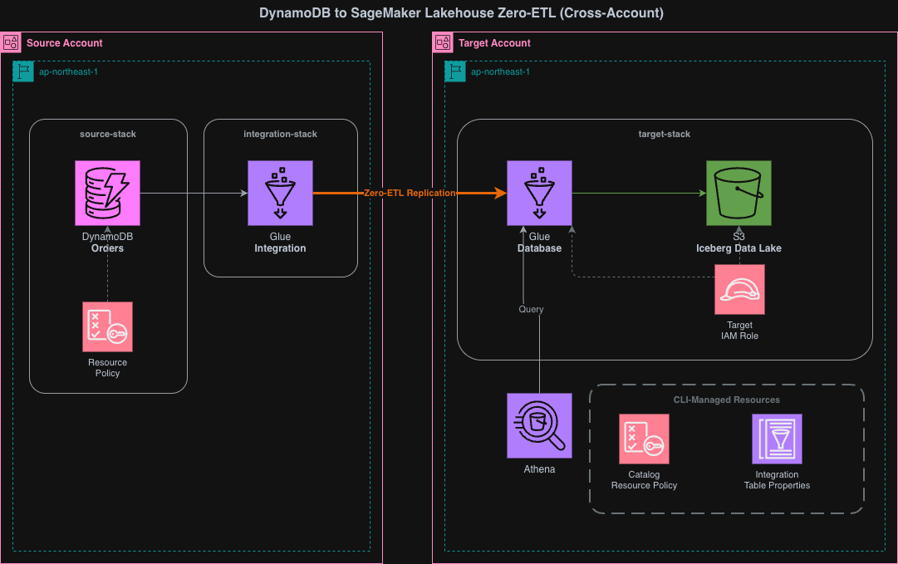

# DynamoDB to SageMaker Lakehouse Zero-ETL (Cross-Account CDK)

Cross-account Zero-ETL integration from DynamoDB
to SageMaker Lakehouse using AWS CDK.

## Project Overview

This project replicates a DynamoDB table in a Source Account
to a Glue Data Catalog (Iceberg format) in a Target Account,
using AWS Glue Zero-ETL integration.
All infrastructure is managed via CDK,
except for the Glue catalog resource policy and
IntegrationTableProperties (UnnestSpec)
which require CLI scripts (no CloudFormation support).

## Architecture



```text
Source Account (CDK: source-stack)
  └── DynamoDB TableV2 (PITR enabled, resource policy)

Target Account (CDK: target-stack)
  ├── S3 Bucket (Iceberg data lake)
  ├── Glue Database
  ├── Target IAM Role
  └── CfnIntegrationResourceProperty (target only)

Target Account (Scripts)
  ├── Glue Catalog Resource Policy (CLI only, no CloudFormation support)
  └── IntegrationTableProperties (UnnestSpec: TOPLEVEL, CLI only)

Target Account (CDK: integration-stack)
  └── CfnIntegration (Zero-ETL Integration)
```

## Key Design Decisions

### TableV2 instead of Table

CDK's `dynamodb.Table` (legacy) does not support resource policies.
`dynamodb.TableV2` provides `addToResourcePolicy()`,
which is required for cross-account Glue access.

### No source CfnIntegrationResourceProperty

Unlike SaaS sources (e.g., Salesforce),
DynamoDB does not require a Glue Connection.
Only the target `CfnIntegrationResourceProperty` is needed.

### Glue Catalog Resource Policy via CLI

`AWS::Glue::ResourcePolicy` is not supported by CloudFormation.
A shell script (`scripts/setup-glue-resource-policy.sh`)
sets the catalog-level policy in the Target Account.

### UnnestSpec via CLI Script

`AWS::Glue::IntegrationTableProperties` is not supported
by CloudFormation. A shell script
(`scripts/setup-integration-table-properties.sh`)
calls the `CreateIntegrationTableProperties` Glue API directly.

UnnestSpec controls how DynamoDB nested structures
(Map, List) are represented in the Glue table:

| Value    | Behavior                                            |
| -------- | --------------------------------------------------- |
| TOPLEVEL | Flatten only top-level Map keys into columns        |
| FULL     | Recursively flatten all nested structures (default) |
| NOUNNEST | Store non-key attributes in a single `value` column |

Changing `unnestSpec` on an existing integration requires
deleting the Glue table, S3 Iceberg data, and the
Zero-ETL integration, then redeploying.

## Configuration

### CDK Parameters (cdk/lib/parameter.ts)

Edit account IDs and refresh interval:

```typescript
export const devParameter: AppParameter = {
  envName: "dev",
  projectName: "cm-kasama-dynamodb-zeroetl",
  refreshIntervalMinutes: 15,
  sourceEnv: {
    account: "111111111111", // TODO: Replace with Source Account ID
    region: "us-east-1",
  },
  targetEnv: {
    account: "222222222222", // TODO: Replace with Target Account ID
    region: "us-east-1",
  },
};
```

### Shell Scripts (scripts/config.sh)

Edit account IDs and unnest spec:

```bash
PROJECT_NAME="cm-kasama-dynamodb-zeroetl"
ENV_NAME="dev"
SOURCE_ACCOUNT_ID="111111111111"
TARGET_ACCOUNT_ID="222222222222"
UNNEST_SPEC="TOPLEVEL"
```

## Prerequisites

- Two AWS accounts (Source and Target)
- AWS CLI configured with profiles for both accounts
- Node.js 20.x or later
- pnpm
- AWS CDK CLI 2.170.0 or later

## Deployment Steps

### 1. Install CDK Dependencies

```bash
cd cdk
pnpm install
```

### 2. Deploy Source Stack (Source Account)

Deploys the DynamoDB table with PITR and resource policy:

```bash
pnpm run cdk deploy cm-kasama-dynamodb-zeroetl-source-stack \
  --profile SOURCE_ACCOUNT_PROFILE
```

### 3. Deploy Target Stack (Target Account)

Deploys S3, Glue Database, IAM Role, and IntegrationResourceProperty:

```bash
cd cdk
pnpm run cdk deploy cm-kasama-dynamodb-zeroetl-target-stack \
  --profile TARGET_ACCOUNT_PROFILE
```

### 4. Run Scripts (Target Account)

Set Glue Catalog Resource Policy and IntegrationTableProperties.
Both must be run before the Integration Stack deployment:

```bash
cd scripts
AWS_PROFILE=TARGET_ACCOUNT_PROFILE ./setup-glue-resource-policy.sh
AWS_PROFILE=TARGET_ACCOUNT_PROFILE ./setup-integration-table-properties.sh
```

### 5. Deploy Integration Stack (Source Account)

Deploys the Zero-ETL Integration.
Cross-account DynamoDB Zero-ETL requires creating the integration from the source account.

```bash
cd cdk
pnpm run cdk deploy cm-kasama-dynamodb-zeroetl-integration-stack \
  --profile SOURCE_ACCOUNT_PROFILE
```

### 6. Verify Deployment

After deployment, verify the integration status:

1. AWS Glue Console > Data Catalog > Zero-ETL integrations
2. Select the created integration
3. Wait for status to become "Active"

### 7. Verify Data

Insert test items into the DynamoDB table.
These items include Map with mixed value types (string/number)
to verify type preservation in Iceberg:

```bash
aws dynamodb batch-write-item \
  --request-items '{
    "Orders": [
      {
        "PutRequest": {
          "Item": {
            "PK":{"S":"order-001"},
            "SK":{"S":"2024-01-01"},
            "amount":{"N":"1500"},
            "customer_name":{"S":"Tanaka"},
            "attributes":{"M":{
              "color":{"S":"red"},"size":{"S":"L"},"weight":{"N":"2.5"}
            }}
          }
        }
      },
      {
        "PutRequest": {
          "Item": {
            "PK":{"S":"order-002"},
            "SK":{"S":"2024-01-02"},
            "amount":{"N":"3200"},
            "customer_name":{"S":"Suzuki"},
            "attributes":{"M":{
              "color":{"S":"blue"},"size":{"S":"M"},"weight":{"N":"1.8"}
            }}
          }
        }
      }
    ]
  }' \
  --profile SOURCE_ACCOUNT_PROFILE
```

Query with Athena (Target Account) to verify type mapping:

```sql
-- Verify all columns and types
SELECT * FROM cm_kasama_dynamodb_zeroetl_dev.orders;

-- Verify Map type preservation (attributes: str->varchar, num->double)
SELECT pk, attributes.color, attributes.weight
FROM cm_kasama_dynamodb_zeroetl_dev.orders;
```

## Directory Structure

```text
63_dynamodb_glue_zeroetl_cross_account/
├── cdk/
│   ├── bin/
│   │   └── app.ts
│   ├── lib/
│   │   ├── parameter.ts
│   │   ├── source-stack.ts
│   │   ├── target-stack.ts
│   │   └── integration-stack.ts
│   ├── package.json
│   ├── tsconfig.json
│   └── cdk.json
├── scripts/
│   ├── config.sh
│   ├── setup-glue-resource-policy.sh
│   └── setup-integration-table-properties.sh
├── docs/
│   └── design.md
├── generated-diagrams/
│   └── dynamodb-zeroetl-cross-account-architecture.png
└── README.md
```

## Resource Ownership

| Resource                     | Stack/Method            | Account |
| ---------------------------- | ----------------------- | ------- |
| DynamoDB Table               | CDK (source-stack)      | Source  |
| DynamoDB Resource Policy     | CDK (source-stack)      | Source  |
| S3 Bucket                    | CDK (target-stack)      | Target  |
| Glue Database                | CDK (target-stack)      | Target  |
| Target IAM Role              | CDK (target-stack)      | Target  |
| IntegrationResourceProperty  | CDK (target-stack)      | Target  |
| Glue Catalog Resource Policy | Shell Script            | Target  |
| IntegrationTableProperties   | Shell Script            | Target  |
| Zero-ETL Integration         | CDK (integration-stack) | Source  |

## Cleanup

Delete resources in reverse order:

```bash
# 1. Integration Stack (Source Account)
cd cdk
pnpm run cdk destroy cm-kasama-dynamodb-zeroetl-integration-stack \
  --profile SOURCE_ACCOUNT_PROFILE

# 2. Target Stack (Target Account)
pnpm run cdk destroy cm-kasama-dynamodb-zeroetl-target-stack \
  --profile TARGET_ACCOUNT_PROFILE

# 3. Glue Catalog Policy (Target Account)
aws glue delete-resource-policy --profile TARGET_ACCOUNT_PROFILE

# 4. Source Stack (Source Account)
pnpm run cdk destroy cm-kasama-dynamodb-zeroetl-source-stack \
  --profile SOURCE_ACCOUNT_PROFILE
```

## References

- [AWS Glue Zero-ETL integrations](https://docs.aws.amazon.com/glue/latest/dg/zero-etl-using.html)
- [DynamoDB Zero-ETL integration with Amazon SageMaker Lakehouse](https://docs.aws.amazon.com/amazondynamodb/latest/developerguide/zero-etl.html)
- [CfnIntegration (CDK API)](https://docs.aws.amazon.com/cdk/api/v2/docs/aws-cdk-lib.aws_glue.CfnIntegration.html)
- [CfnIntegrationResourceProperty (CDK API)](https://docs.aws.amazon.com/cdk/api/v2/docs/aws-cdk-lib.aws_glue.CfnIntegrationResourceProperty.html)
- [AWS::Glue::Integration (CloudFormation)](https://docs.aws.amazon.com/AWSCloudFormation/latest/TemplateReference/aws-resource-glue-integration.html)
