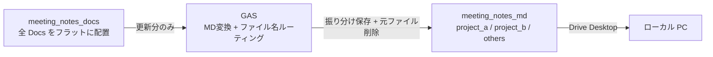
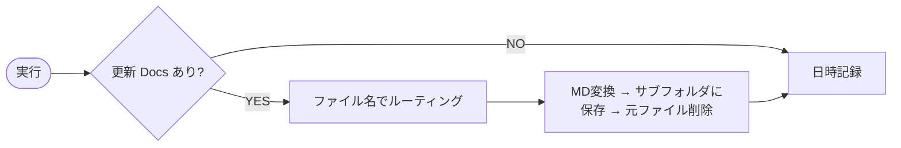

# Google Docs フォルダ監視 → Markdown 自動エクスポート セットアップ手順

## 概要

Google Drive の監視フォルダ内にある Google Docs を定期チェックし、新規・更新されたファイルを Markdown に変換する。ファイル名のキーワードでプロジェクト別サブフォルダに振り分けて保存し、変換後に元の Google Docs を削除する。Google Drive Desktop 経由でローカルに自動同期される。

## アーキテクチャ



## 処理フロー



## 前提条件

- Google アカウント
- [Google Drive Desktop](https://www.google.com/drive/download/) がインストール済み

## 手順

### 1. Google Drive のフォルダ構成

監視フォルダと出力フォルダを用意する。監視フォルダはフラット（サブフォルダなし）で、出力フォルダにプロジェクト別サブフォルダが自動作成される。

```text
マイドライブ/
├── meeting_notes_docs/    ← WATCH_FOLDER_ID（この中に .gdoc をフラットに配置）
│   ├── プロジェクトA_定例_2025-02-10.gdoc
│   ├── プロジェクトB_進捗報告.gdoc
│   └── 社内MTG_メモ.gdoc
└── meeting_notes_md/      ← OUTPUT_FOLDER_ID（ここに .md を出力）
    ├── project_a/          ← ファイル名に「プロジェクトA」を含む → 自動振り分け
    ├── project_b/          ← ファイル名に「プロジェクトB」を含む → 自動振り分け
    └── others/            ← どのキーワードにもマッチしない → others
```

それぞれの URL からフォルダIDをコピーする。

```text
https://drive.google.com/drive/folders/【このフォルダID】
```

### 2. GAS プロジェクトを作成

1. [script.google.com](https://script.google.com) を開く
2. 「新しいプロジェクト」をクリック
3. プロジェクト名を入力（例: `Docs to Markdown`）
4. デフォルトの `コード.gs` の中身を全て削除
5. `gas-gdocs-to-markdown.js` の内容を全て貼り付け
6. Ctrl+S（Mac: Cmd+S）で保存する
    - 保存すると上部ツールバーの「No functions」が関数一覧に変わる
    - 保存しないと関数が認識されないので注意

### 3. スクリプト プロパティを設定

GAS エディタ左メニュー「プロジェクトの設定」（歯車）→「スクリプト プロパティ」に以下を登録する。

| プロパティ名           | 値                                | 説明                                  |
| ---------------------- | --------------------------------- | ------------------------------------- |
| `WATCH_FOLDER_ID`      | meeting_notes_docs のID           | 監視対象フォルダ                      |
| `OUTPUT_FOLDER_ID`     | meeting_notes_md のID             | .md 出力先の親フォルダ                |
| `ROUTING_RULES`        | プロジェクトA:project_a,プロジェクトB:project_b | ファイル名キーワード:出力サブフォルダ |
| `TRIGGER_DAILY_HOUR`   | 18                                | 日次実行の時間台 (0-23)               |

`ROUTING_RULES` はカンマ区切りで複数ルールを設定できる。ファイル名に含まれるキーワードとコロンの後に出力先サブフォルダ名を指定する。どのルールにもマッチしないファイルは `others` に振り分けられる。

### 4. 初回実行（認証許可）

1. 上部ツールバーの関数ドロップダウン（Debug の右隣）で `exportAll` を選択
    - 「No functions」と表示されている場合は手順2の保存（Ctrl+S）ができていない
2. 「Run」（▷）をクリック（右上の緑色「Deploy」ボタンではない）
3. 「Authorization required」ダイアログ → 「Review permissions」をクリック
4. Google アカウントを選択
5. 権限の許可画面で3つ全てにチェック（または「Select all」）→「Continue」
    - See, edit, create, and delete all of your Google Drive files
        - Drive のファイル読み書き。Docs の読み取りと .md の作成・上書きに必要
    - Connect to an external service
        - 外部 HTTP リクエスト。Docs エクスポート API の呼び出しに必要
    - Allow this application to run when you are not present
        - 不在時の自動実行。定期トリガーの動作に必要
6. 下部の「Execution log」に以下のようなログが表示されれば成功

```text
プロジェクトA_定例_2025-02-10 → project_a/プロジェクトA_定例_2025-02-10.md
Deleted: プロジェクトA_定例_2025-02-10
プロジェクトB_進捗報告 → project_b/プロジェクトB_進捗報告.md
Deleted: プロジェクトB_進捗報告
Done. 2 file(s) exported.
```

### 5. 定期実行トリガーを設定

1. 関数ドロップダウンで `setupTrigger` に切り替え
2. 「Run」（▷ ボタン）をクリック
3. Execution log に `Trigger set: daily at 18:00` と表示されれば完了

### 6. Google Drive Desktop で同期

1. Google Drive Desktop の設定を開く
2. `meeting_notes_md` フォルダが同期対象に含まれていることを確認
    - 「マイドライブ」全体を同期している場合は設定不要
    - 特定フォルダのみ同期している場合は、出力フォルダを追加
3. ローカルの同期先パスを確認

```text
例: ~/Google Drive/マイドライブ/meeting_notes_md/
```

## 動作確認

1. 監視フォルダに Google Docs を作成 or 編集する
2. 次の定期実行を待つ（またはGASで `exportChanged` を手動実行）
3. 出力フォルダのファイル名に対応するサブフォルダに .md が生成される
4. 元の Google Docs がゴミ箱に移動される
5. ローカルの同期先に .md がダウンロードされる

## Google Docs 生成プロンプト

会議メモを Google Docs で作成する際、AI に以下のプロンプトを渡すことで YAML frontmatter 付きの Markdown 形式で生成できる。

```text
Copy the document tab "メモ" and convert to Markdown.
Start with this header (one field per line):

---
date: YYYY-MM-DD
project: lowercase-name
summary: 日本語で一文要約
---

Then the meeting content.
```

生成された Google Docs を監視フォルダに配置すると、GAS が自動で Markdown 変換してローカルに同期する。

## 補足

- トリガー設定の変更: スクリプト プロパティを変更 → `setupTrigger` を再実行
- トリガーの停止: GAS 左メニュー「トリガー」からトリガーを削除
- ファイル名: Google Docs のファイル名がそのまま `.md` のファイル名になる（`/` 等の記号と空白は `_` に置換）
- サブフォルダ自動作成: ルーティング先のサブフォルダが存在しない場合、出力フォルダ内に自動作成される
- 元ファイル削除: 変換成功後、元の Google Docs はゴミ箱に移動される（30日以内なら復元可能）
- ルーティング: `ROUTING_RULES` は先頭から順にマッチし、最初にヒットしたルールが適用される
