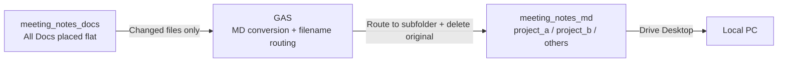
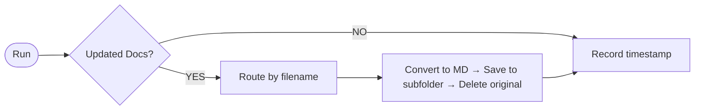

# Google Docs Folder Watch - Markdown Auto-Export Setup Guide

## Overview

Periodically checks a Google Drive watch folder for Google Docs, converts new or updated files to Markdown, routes them to project-specific subfolders based on filename keywords, and deletes the originals. The exported Markdown files are synced to your local machine via Google Drive Desktop.

## Architecture



## Processing Flow



## Prerequisites

- A Google account
- [Google Drive Desktop](https://www.google.com/drive/download/) installed

## Setup

### 1. Google Drive Folder Structure

Prepare a watch folder and an output folder. The watch folder is flat (no subfolders). Project-specific subfolders are created automatically in the output folder.

```text
My Drive/
├── meeting_notes_docs/    ← WATCH_FOLDER_ID (place .gdoc files flat here)
│   ├── ProjectA_standup_2025-02-10.gdoc
│   ├── ProjectB_progress_report.gdoc
│   └── Internal_MTG_notes.gdoc
└── meeting_notes_md/      ← OUTPUT_FOLDER_ID (.md files are exported here)
    ├── project_a/          ← Filename contains "ProjectA" → auto-routed
    ├── project_b/          ← Filename contains "ProjectB" → auto-routed
    └── others/            ← No keyword match → others
```

Copy the folder ID from each folder's URL.

```text
https://drive.google.com/drive/folders/<FOLDER_ID>
```

### 2. Create a GAS Project

1. Open [script.google.com](https://script.google.com)
2. Click "New project"
3. Enter a project name (e.g., `Docs to Markdown`)
4. Delete all content from the default `Code.gs`
5. Paste the entire contents of `gas-gdocs-to-markdown.js`
6. Press Ctrl+S (Mac: Cmd+S) to save
   - After saving, the "No functions" dropdown in the toolbar will show the function list
   - Functions are not recognized until you save

### 3. Configure Script Properties

Go to "Project Settings" (gear icon) in the GAS editor left menu, then add the following under "Script Properties".

| Property             | Value                                 | Description                     |
| -------------------- | ------------------------------------- | ------------------------------- |
| `WATCH_FOLDER_ID`    | ID of meeting_notes_docs              | Folder to watch                 |
| `OUTPUT_FOLDER_ID`   | ID of meeting_notes_md                | Parent folder for .md output    |
| `ROUTING_RULES`      | ProjectA:project_a,ProjectB:project_b | keyword:subfolder pairs         |
| `TRIGGER_DAILY_HOUR` | 18                                    | Hour for daily execution (0-23) |

`ROUTING_RULES` accepts multiple comma-separated rules. Each rule maps a filename keyword (before the colon) to an output subfolder name (after the colon). Files that match no rule are routed to `others`.

### 4. Initial Run (Authorization)

1. Select `exportAll` from the function dropdown (next to the Debug button) in the toolbar
   - If "No functions" is displayed, save the file first (Ctrl+S) as described in step 2
2. Click "Run" (the play button), not the green "Deploy" button
3. In the "Authorization required" dialog, click "Review permissions"
4. Select your Google account
5. Check all three permissions (or "Select all") and click "Continue"
   - See, edit, create, and delete all of your Google Drive files
     - Required for reading Docs and creating/overwriting .md files
   - Connect to an external service
     - Required for calling the Docs export API via HTTP
   - Allow this application to run when you are not present
     - Required for scheduled trigger execution
6. If the "Execution log" at the bottom shows output like the following, the setup is successful

```text
ProjectA_standup_2025-02-10 → project_a/ProjectA_standup_2025-02-10.md
Deleted: ProjectA_standup_2025-02-10
ProjectB_progress_report → project_b/ProjectB_progress_report.md
Deleted: ProjectB_progress_report
Done. 2 file(s) exported.
```

### 5. Set Up Scheduled Trigger

1. Switch to `setupTrigger` in the function dropdown
2. Click "Run" (the play button)
3. If the execution log shows `Trigger set: daily at 18:00`, setup is complete

### 6. Sync with Google Drive Desktop

1. Open Google Drive Desktop settings
2. Confirm that the `meeting_notes_md` folder is included in sync targets
   - No configuration needed if "My Drive" is synced entirely
   - If only specific folders are synced, add the output folder
3. Verify the local sync path

```text
Example: ~/Google Drive/My Drive/meeting_notes_md/
```

## Verification

1. Create or edit a Google Doc in the watch folder
2. Wait for the next scheduled run (or manually run `exportChanged` in GAS)
3. A .md file is generated in the subfolder matching the filename
4. The original Google Doc is moved to trash
5. The .md file is downloaded to your local sync destination

## Google Docs Generation Prompt

When creating meeting notes in Google Docs, use the following prompt with AI to generate Markdown with YAML frontmatter.

```text
Copy the document tab "Notes" and convert to Markdown.
Start with this header (one field per line):

---
date: YYYY-MM-DD
project: lowercase-name
summary: one-line summary
---

Then the meeting content.
```

Place the generated Google Doc in the watch folder, and GAS will automatically convert it to Markdown and sync it locally.

## Notes

- To change trigger settings, update Script Properties and re-run `setupTrigger`
- To stop the trigger, delete it from "Triggers" in the GAS left menu
- File naming: the Google Doc filename becomes the .md filename (`/` and other special characters and spaces are replaced with `_`)
- Auto-creation of subfolders: if a routing target subfolder doesn't exist, it is created automatically in the output folder
- Original file deletion: after successful conversion, the original Google Doc is moved to trash (recoverable within 30 days)
- Routing priority: `ROUTING_RULES` are evaluated in order; the first matching rule is applied
